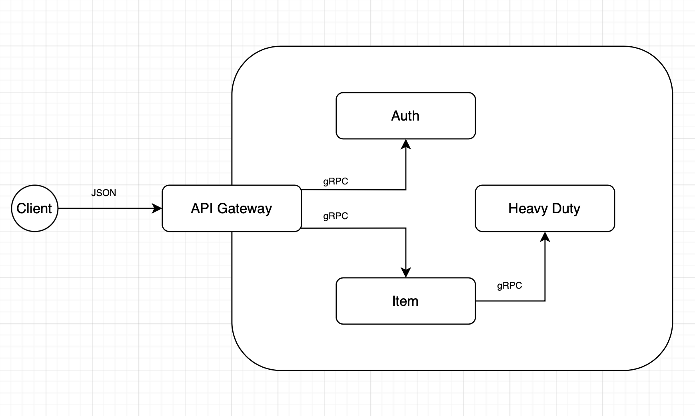

Mini demo example of microservice architecture using gRPC.

Schema:

This example can possibly be run using Docker:
- clone the repository to your local machine;
- if necessary, change the environment settings in the example.env file;
- run the `docker compose up` command;
- Swagger documentation is available on `localhost:8081/docs`.

It is also possible to run this example in Kubernetes Minikube:
- clone the repository to your local machine;
- launch Minikube: `minikube start` (Minikube must be pre-installed);
- from inside the `kuber` directory apply all manifests: `kubectl apply -f .`;
- then runs the command: `minikube service gateway`;
- Swagger documentation is available on the `localhost:{automatically running port}/docs`

Command to generate the necessary files based on .proto:
`python -m grpc_tools.protoc  --python_out=. --pyi_out=. --grpc_python_out=. --proto_path=. ./protos/*.proto`
